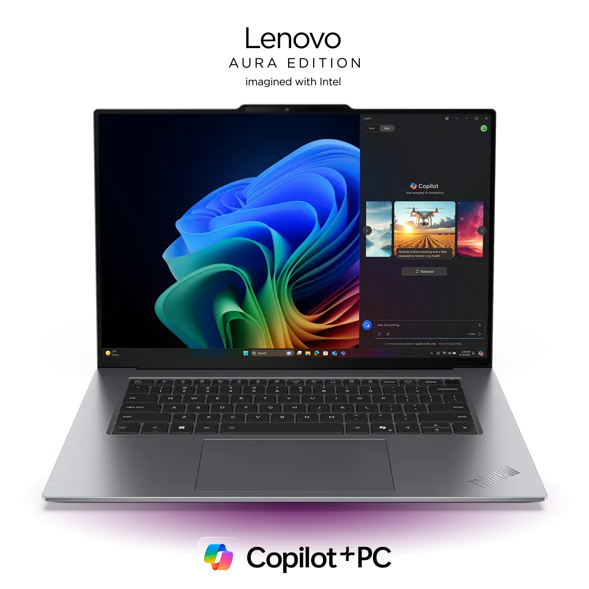
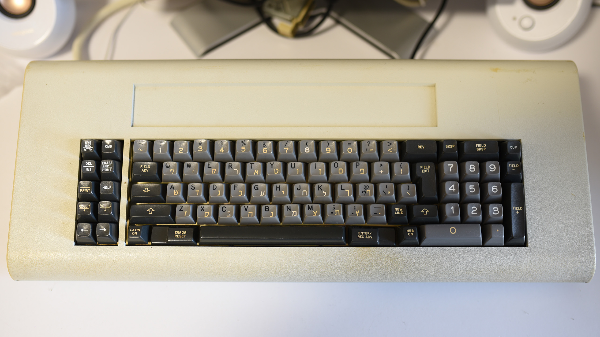
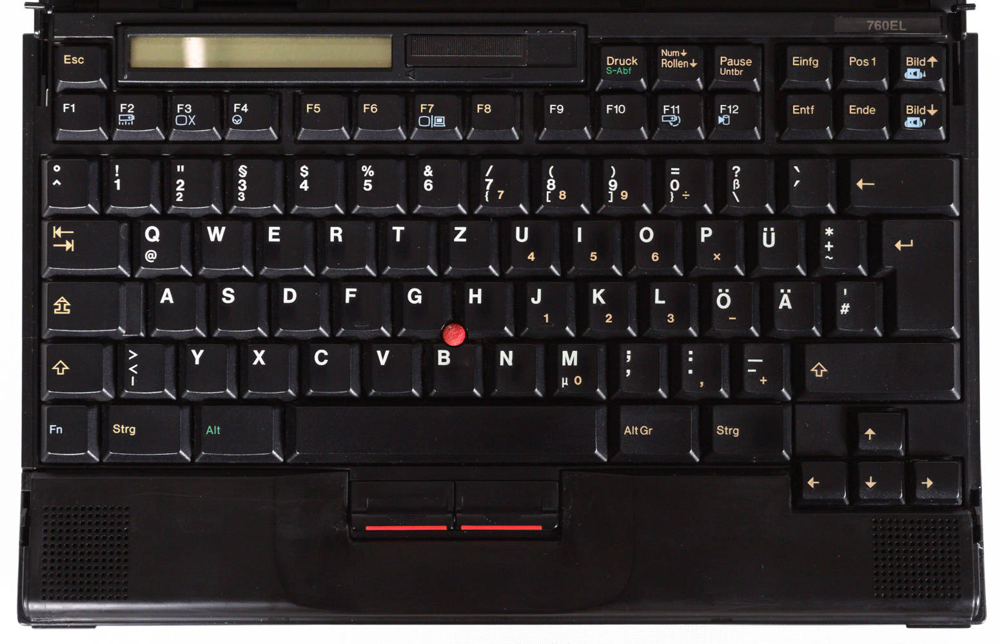
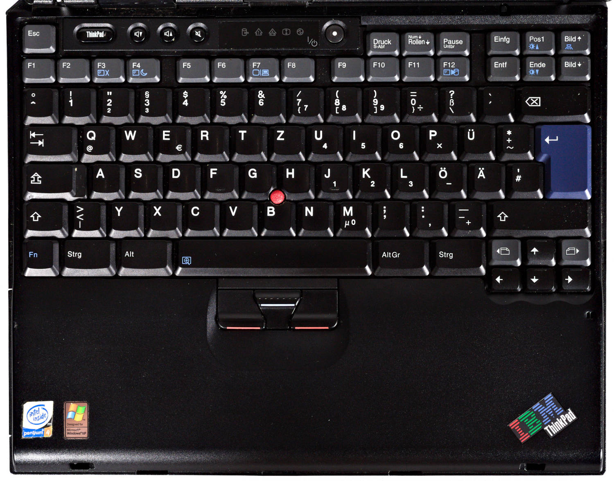
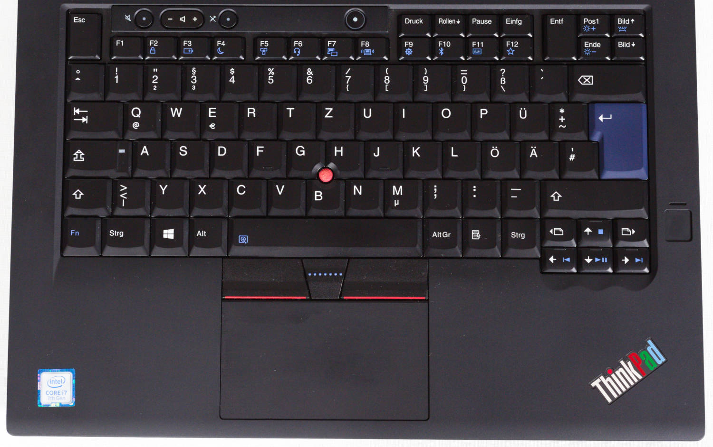
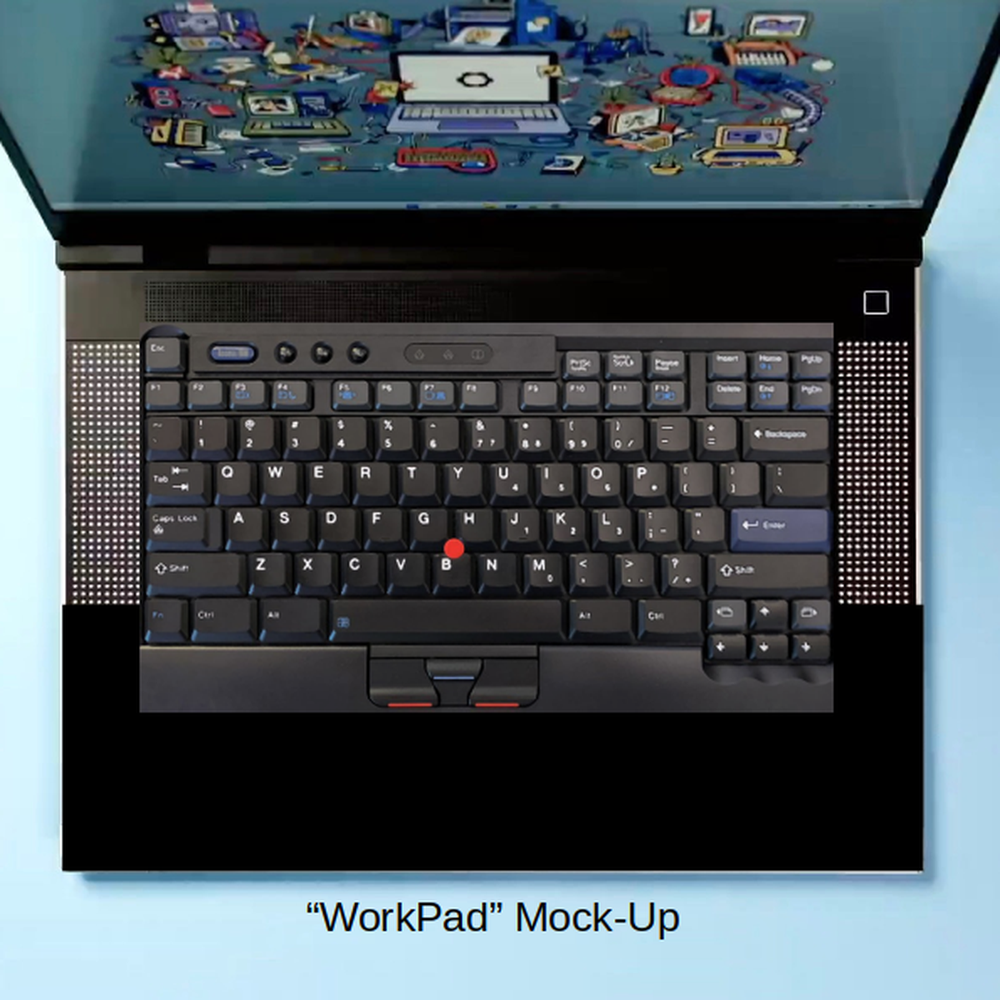
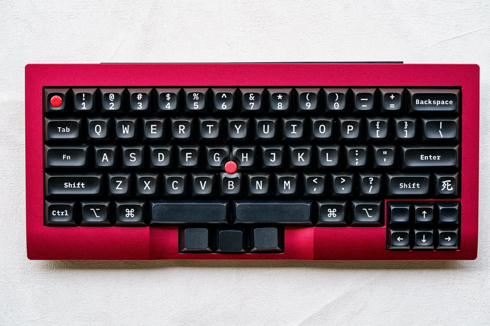
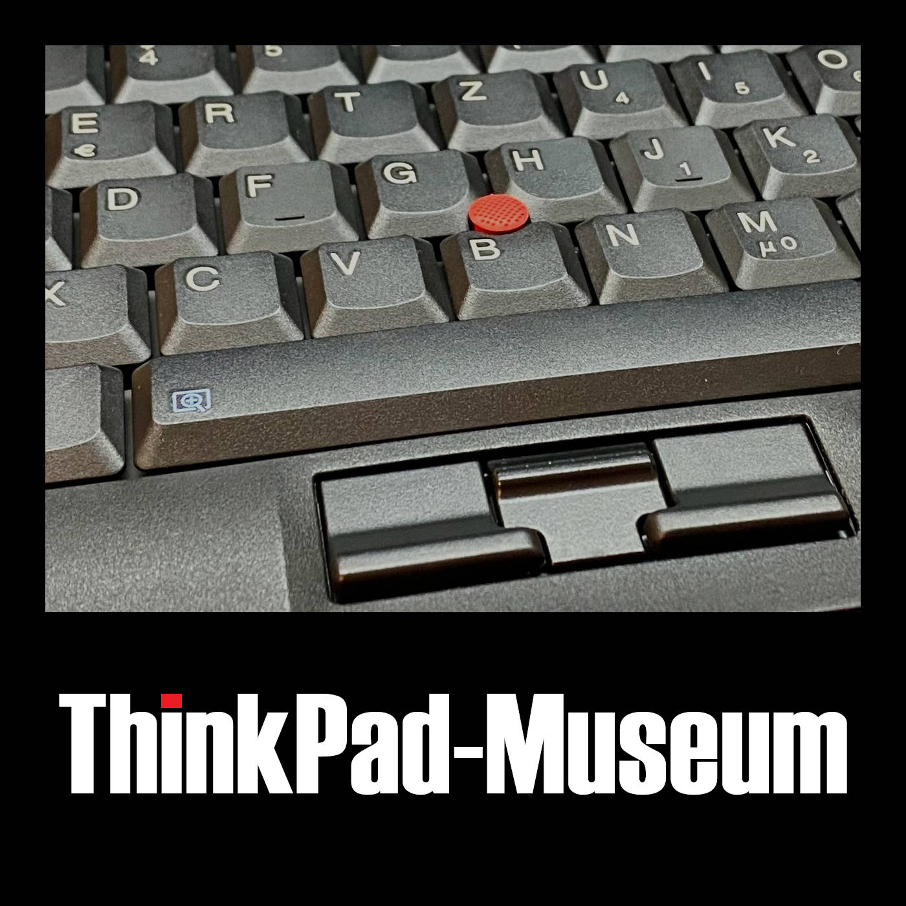

<!-- _class: lead -->

# 🔴 ThinkPads

#### Eingabegeräte

 

Christian ~~Clackowic~~ Stankowic
CCH|CON 2025
08.02.2025

---

<!-- _header: `whoami` -->

- Christian Stankowic
- [@stdevel@chaos.social](https://chaos.social/@stdevel) 🐘
- IT-Berater und -Trainer 👨🏻‍🏫
- sammelt obsolete Hardware
- Blogger ([cstan.io](https://cstan.io) 📖)
- Podcaster 🎙️
  - [FOCUS ON: Linux](https://focusonlinux.podigee.io) 🐧
  - [Faxinformatiker](https://faxinformatiker.de) 📠
  - [ThinkPad-Museum](https://thinkpad-museum.de/episode) 💻

---

<!-- _header: ThinkPad-Museum -->

- Online-Museum als **Blog**
- listet Details der Sammlung auf
  - **68** <u>unterschiedliche</u> Notebooks
  - **3** PDAs
  - **12** Docking Stationen
- **WIP**: Bilder-Galerien und ergänzende Artikelserien
- monatlicher **Podcast**
- 🔴 [thinkpad-museum.de](https://thinkpad-museum.de)

---

<!-- _header: ThinkPad-Museum -->

Teil der Sammlung

Transport der Sammlung

---

<!-- _header: Agenda -->

1. Was bisher geschah... ⏪
1. Kurzgeschichte des TrackPoints 🔴
1. Tastaturen ⌨️
1. Hacks und Ausblick 🔨

---

<!-- _header: '`tar cvfz tldw.tgz https://media.ccc.de/v/froscon2024-3141-thinkpads`' -->

- ThinkPads werden in Business- und Hacker:innen-Kreisen häufig angetroffen
- **1992** bis **2005** von IBM produziert, seitdem von Lenovo
- stehen für **robuste** und langlebige Geräte
- **zeitloses** Design, praktikabel
- unterschiedliche **Serien** mit vielen Modellen

PDS: Du hast dir [Teil 1](https://media.ccc.de/v/froscon2024-3141-thinkpads) angesehen

---

<!-- _header: Zeitloses Design, das heute noch erkennbar ist -->

IBM ThinkPad T23 (2001)

Lenovo ThinkPad T470p (2017)

<!--

- Clamshell-Design entfällt bei Lenovo
- blauer Farbton entfällt
- rote Akzente bei TrackPoint und TrackPad bestehen weitehrin
- schräges Logo ist weiterhin eine Marke

-->

---

<!--
_header: Richard Sapper (1932 - 2015†)
footer: '[[1]](https://en.wikipedia.org/wiki/Richard_Sapper)'
-->

- einer der wichtigsten Produktdesigner der zweiten Hälfe des 20.Jahrhunderts
- bekannt für zahlreiche innovative Designs, u.a.
  - Artemide Tizio-Tischlampe
  - Alessi-Küchengeräte
  - ...
- ab 1979 **leitender Designberater** bei IBM
- prägte und vereinheitlichte IBM-Designs
  - **schwarze** Farbe bei ThinkPads
  - **roter** TrackPoint

---

<!-- _header: Richard Sapper -->
<!-- footer: '[[2]](https://commons.wikimedia.org/wiki/File:Lampe_Tizio_von_Richard_Sapper.jpg), [[3]](https://richardsapperdesign.com/products/mod-5140/)' -->

Artemide Tizio

IBM PC Convertible Model 5140

<!--

- Lorenz Static (1960)
- IBM PC Convertible Model 5140 (1986)

-->

---

<!-- _header: IBM PC Convertible Model 5140 (1986) -->
<!-- footer: '[[3]](https://richardsapperdesign.com/products/mod-5140/)' -->

---

<!--
footer: '[[4]](https://www.reddit.com/r/thinkpad/comments/h16v1f/tizio_and_thinkpad_the_perfect_classical)' -->

<!--

- Artemide Tizio 50 + ThinkPad T430

-->

---

<!-- _header: Ready? -->
<!-- footer: '' -->

---

<!-- _header: Kurzgeschichte des TrackPoints -->
<!-- footer: '[[5]](https://youtu.be/Wpw7Bml_XvI), Patent lief **2007** aus, auch andere Hersteller hatten vorher bereits Alternativen' -->

- in den späten **1980ern** von **Dr. Ted Selker** als Mausersatz erfunden*
- Gummifläche zwischen den **G**-, **H**- und **B**-Tasten
- **präzise** Bedienung, erinnert an **Joystick**
  - Finger kann auf der Tastatur verweilen
  - kein "Touchpad-Rudern"
  - erfordert Training
- ging mit dem ThinkPad 700 in Serie
  - inspirierte auch andere Hersteller

---

<!-- _header: Kurzgeschichte des TrackPoints -->
<!-- footer: '[[6]](https://de.wikipedia.org/wiki/Datei:Pointing_stick_of_a_Lenovo_ThinkPad_keyboard-4488.jpg), Patent lief **2007** aus, auch andere Hersteller hatten vorher bereits Alternativen' -->

- Funktion beruht auf **Messung** der ausgeübten Kraft über **Dehnungsstreifen**
- diese werden **elastisch** verformt, dauerhaft angelegte **Spannung** verändert sich so
- integrierter Schaltkreis wandelt diese analogen Signale um
- inzwischen auch in anderen Tastaturen zu finden

---

<!-- _header: Trivia: Unterschiedliche TrackPoint-Typen -->
<!-- footer: '[[7]](https://www.reddit.com/r/thinkpad/comments/h16v1f/tizio_and_thinkpad_the_perfect_classical)' -->

<!--

- wurden die Jahre über immer optimiert
- wurden kleiner, da die Geräte auch kleiner werden
- billige Replicas erkennt man daran, dass sie schnell **speckig** werden

-->

---

<!-- _header: Stilbruch: erstes ThinkPad ohne TrackPoint 😰 -->
<!-- footer: '' -->

- [Auf der CES 2025](https://www.golem.de/news/thinkpad-x9-neues-design-aendert-tastatur-und-streicht-trackpoint-2501-192155.html) wurde die neue **X9 Aura Edition**-Serie vorgestellt
  - bewusst für neue Kundschaft konzipiert
- in 14" und 15" erhältlich
- disruptives **Redesign**, silbernes statt schwarzes Gehäuse
- überarbeitete Tastatur mit CoPilot-Taste und **ohne TrackPoint**
- schlanker Formfaktor: zwischen 6,7 und 17,2 mm Gehäusehöhe
- umstritten, stark negatives Feedback aus der Community
- Jerry Paradise (Lenovo VP) [sagte 2022](https://www.notebookcheck.com/Lenovo-verspricht-TrackPoint-bleibt-fuer-immer-Bestandteil-der-ThinkPads.676587.0.html):

> "Wir glauben, dass es den TrackPoint immer geben wird, solange die Marke ThinkPad existiert. Das ist unser Versprechen an unsere Kund:innen, und wir glauben, dass es immer noch ein ikonischer Bestandteil des ThinkPad-Designs ist". 

---

<!-- _header: Stilbruch: erstes ThinkPad ohne TrackPoint 😰 -->
<!-- footer: '[[8]](https://www.lenovo.com/de/de/p/laptops/thinkpad/thinkpadx9/thinkpad-x9-aura-edition-15-inch-intel/len101t0111)' -->

---

<!-- _header: Tastaturen -->
<!-- footer: '' -->

- waren lange **USP** für ThinkPads
  - angenehmes taktiles Feedback
  - unverwüstliche Qualität
  - einfach zu wechseln
- IBM baute lange hochwertige Tastaturen
- zahlreiche Veränderungen im Laufe der Jahre
  - inzwischen nichts Besonderes mehr 🥲

---

<!-- _header: IBM und Tastaturen -->
<!-- footer: 'Höre auch [CCH029 - Model F 🎙️](https://www.clickclackhack.de/029.html) und [CCH015 - Model M 🎙️](https://www.clickclackhack.de/015.html)' -->

- IBM hat nach Schreibmaschinen lange Tastaturen produziert
  - [Model B](https://sharktastica.co.uk/wiki?id=modelb) - **Beamspring** (1972 - 1983)
  - [Model F](https://sharktastica.co.uk/wiki?id=modelf) - kapazitive **Buckling Springs** (1981 - 1986)
  - [Model M](https://sharktastica.co.uk/wiki?id=modelm) - Membran Buckling Springs (1984 - 1996)
- Nicht alle Tastaturen waren legendär: **IBM PCjr Keyboard**
- 1991 wurde Lexmark durch die Veräußerung von IBMs Drucker-/Tastatursparte gegründet
- 1996 stellte IBM den Verkauf von Buckling Spring-Tastaturen ein
- Ex-IBM/-Lexmark-Mitarbeitende gründeten so [Unicomp](https://www.pckeyboard.com)
- Model F und B werden seit 2016 auch [wieder produziert](https://www.modelfkeyboards.com/)

---

<!--
_header: 'IBM PCjr Keyboard (1984)'
footer: '[[9]](https://regmedia.co.uk/2014/03/20/keyboard_chiclet_large.jpg)' -->

---

<!--
_header: '5251/5252 Display Station Typewriter Keyboard (1977)'
footer: '[[10]](https://sharktastica.co.uk/wiki?id=modelb)' -->

---

<!--
_header: 'IBM 3290 Information Panel Data Typewriter Keyboard (1983)'
footer: '[[11]](https://sharktastica.co.uk/wiki?id=modelf)' -->

---

<!--
_header: 'IBM Enhanced Keyboard (1985)'
footer: '[[12]](https://sharktastica.co.uk/wiki?id=modelm)' -->

---

<!-- _header: ThinkPad-Tastaturen -->
<!-- footer: '[[13]](https://deskthority.net/wiki/Scissor_switch)' -->

- alle Generationen haben **Scissor Switches**
  - früher NMB, Chicony, ALPS, inzwischen nur noch Chicony und LiteOn
- gegenüberliegende Stabilisatoren, über ein Scharnier verbunden
- ermöglicht Scherenmechanismus mit geringer Höhe
- der **Tastenhub** sank über die Jahre
  - 3mm (199x), 2.5mm (2000-2012), 2.1mm (2013-2017), **1.8mm** (2016-2021), 1.5mm (2021-2024), 1,35mm (seit 2021)

---

<!-- _header: TrackWrite-Keyboard (1995 - 1996) -->
<!-- footer: 'Patent- und Markenamt so: Lol, nein 🙅🏻‍♂️' -->

- Tastatur des **701**, welches ursprünglich **Butterfly** heißen sollte*
- ca. **24.7 cm** breite Tastatur, schiebt sich auf **29,3 cm** aus
  - in etwa so breit wie die Tastatur eines T60, beachtlich komfortabel
  - Tastatur klappt sich **diagonal** aus
- Produktion des Geräts **verzögerte** sich mehrfach
  - u.a. aufgrund der Tastatur
  - als es 1995 erschien war der 80486 hoffnungslos veraltet
- Gerät gewann zahlreiche Preise
  - kommerziell aber kein Erfolg
- ikonischstes ThinkPad aller Zeiten

---

<!-- _header: TrackWrite-Keyboard (1995 - 1996) -->
<!-- footer: '[[14]](https://en.wikipedia.org/wiki/File:IBM_ThinkPad_701C_keyboard.jpg), [[15]](https://youtu.be/rDjg4dKWQ2Y)' -->

---

<!-- _header: OG-Tastatur (hier: 760EL, 1996) -->
<!-- footer: '' -->

- 7-reihiges Design, bei kleinen Geräten nur 6 Reihen (z.B. 240)
- keine Sondertasten oder LEDs, vom 700 (1992) bis zum 600X (2000)

<!--

- Blaue und grüne Markeriungen für Mehrfachbelegungen

-->

---

<!-- _header: 'Klassische Tastatur (hier: T23, 2002)' -->

- mit dem A/T/X20 eingeführt, brachte u.a. **mittlere Maustaste**
- **Sondertasten** (Lautstärke, Setup), Status-**LEDs** und An/Aus-Knopf

---

<!-- _header: 'Klassische Tastatur (hier: T30, 2003)' -->

- ab dem T/R/X30 leicht verändertes Design
  - blaue und graue Farben, kleinere Maustasten (**UltraNav**-Vorbereitung)

---

<!-- _header: 'Klassische Tastatur (hier: R40, 2003)' -->

- keine Status-LEDs mehr ab dem T/R/X/G40 , **Access IBM**-Taste

<!--

- BIOS-Aufruf über Access IBM-Taste
- Pre-Boot-Environment mit Restore-Funktion
  - erfordert Service-Partition auf der Festplatte

-->

---

<!-- _header: 'Klassische Tastatur (hier: T60p, 2007)' -->

- kein grauer Kontrast mehr ab T/R/X60
- TrackPoint-Tasten haben keine Farben mehr

---

<!-- _header: 'Klassische Tastatur (hier: T410, 2010)' -->

- ab dem T410/X220 **beleuchtete** Funktionstasten, **Wippschalter** für Lautstärke sowie **doppelte Höhe** der ESC/ENTF-Taste

---

<!-- _header: Precision-Keyboard -->
<!-- footer: '[[16]](https://nuts.com/images/auto/801x534/assets/869ed4decfec61cb.jpg)' -->

- **2012** in **T**-, **W**-, **X**- und **L**-Serien eingeführt
  - erstmalig im **X1** verbaut
  - weitere Tests in der Edge- und X1xxe-Serie
- **Chiclet**- bzw. Island Style-Tastatur
  - flache quadratische Tasten mit abgerundeten Ecken
  - erinnern an amerikanische Chiclet-**Kaugummis**
- **6** statt 7 Reihen, auch bei großen Geräten
  - mehr **Freiräume** zwischen den Tasten
  - **größere** Tasten, soll Tippfehlern vorbeugen
  - keine separate Funktionstasten mehr

---

<!-- _header: Precision-Keyboard (X230, 2012) -->
<!-- footer: '' -->

---

<!-- _header: Precision-Keyboard -->

- Seite vorwärts/weiter weicht Bild runter/hoch
- keine Num- und Kontextmenü-Tasten mehr
- keine blauen Farbelemente mehr
- Tasten nur noch **2mm** statt 2,5mm **hoch**
- **Mechanismus** jedoch unverändert
- **Backlight**, dadurch Entfall des **ThinkLights**
- Tastaturbeschichtung variiert je nach Variante
  - ohne Backlight: matt, rutschfest, undurchsichtig
  - mit Backlight: glatter, leicht rutschiger Finish

---

<!-- _header: Revival des Classic Keyboards (T25, 2017) -->

---

<!-- _header: Hacks -->

- [WorkBook](https://hackaday.io/project/191579-workbook-framework-13-classic-kb-trackpoint) 👻
  - Mockup für **Framework 13** mit Classic Keyboard und TrackPoint
- [ThinKeys](https://github.com/moduloindustries/thinkeys)-Projekt
  - **Ortholineare** Tastatur für T410-30, T510-30, W510-30 und X220/230
  - **QMK**, mit TrackPoint, kann auch extern via USB-C benutzt werden

- Spannende **Switches** für sehr flache Tastaturen
  - [Cherry MX ULP Tactile](https://www.cherry.de/mx-ulp-tactile) (65 cN, 1.8mm Travel, LED Underglow, 50 Mio.)
  - [Kailh PG1316S](https://keycapsss.com/switchestester/switches/282/kailh-pg1316s-ultra-thin-notebook-switch) (32-60 cN, 1.8mm Travel, LED Underglow, 20 Mio.)
- [mnhTTn](https://github.com/fooker/mnhttn) (**erste** DIY-Split mit Cherry MX ULP-Switches, 36 Tasten)

---

<!-- _header: WorkBook und ThinKeys -->
<!-- footer: '[[17]](https://hackaday.io/project/191579-workbook-framework-13-classic-kb-trackpoint), [[18]](https://github.com/moduloindustries/thinkeys)' -->

WorkBook (2024)

ThinKeys (2022)

---

<!-- _header: Cherry MX ULP Tactile und mnhTTn -->
<!-- footer: '[[19]](https://www.cherry.de/de-de/produkt/mx-ulp-tactile), [[20]](https://github.com/fooker/mnhttn)' -->

Cherry MX ULP Tactile (2024)

mnhTTn (2024)

---

<!-- _header: Einfluss auf mechanische Tastaturen -->
<!-- footer: '' -->

- Es gibt auch mechanische Tastaturen im *ThinkPad-Stil*, u.a.:
  - [Tex Shinobi](https://tex.com.tw/products/shinobi)
    - Replica des IBM/Lenovo [SK-8845](https://sharktastica.co.uk/topics/trackpoint_kbs#SK-8845)/[8855](https://sharktastica.co.uk/topics/trackpoint_kbs#SK-8855)
    - ABS, Cherry MX1A, USB-C, 1.2 kg
    - optional als [DIY-Edition](https://tex.com.tw/products/shinobi-diy-type) mit Hotswap
  - [Tex Shura](https://tex.com.tw/products/shura) (60%, TrackPoint und UltraNav)
    - ABS (US) bzw Laser (EU/JIS), Cherry MX1A, USB-C, 1.0 kg
    - optional als [DIY-Edition](https://tex.com.tw/products/shura-diy-type) mit Hotswap (aber ohne ISO-DE 🤡🤡🤡)
- Keycaps
  - [GMK ThinkCaps](https://drop.com/talk/39383/gmk-think-caps), schwarze Tasten, graue und blaue Akzente
    - optional auch klassische IBM-Farben

<!--

- auch als Hotswap und ISO-DE erhältlich

-->

---

<!-- _header: Lenovo SK-8855 und Tex Shinobi -->
<!-- footer: '[[21]](https://sharktastica.co.uk/topics/trackpoint_kbs#SK-8855), [[22]](https://tex.com.tw/products/shinobi)' -->

Lenovo SK-8855 (2009)

Tex Shinobi (2020)

---

<!-- _header: Tex Shura (2022) -->
<!-- footer: '[[23]](https://tex.com.tw/products/shura)' -->

Optionales Aluminium-Gehäuse

---

<!-- _header: Links -->
<!-- footer: '' -->

- [FrOSCon 2024: ThinkPads - Geschichte und Nerdkultur](https://github.com/stdevel/froscon2024-thinkpads/) [🎥](https://media.ccc.de/v/froscon2024-3141-thinkpads)
- [MRMCD 2024: Eingabegeräte und Kuriositäten](https://github.com/stdevel/mrmcd2024-thinkpads/) [🎥](https://media.ccc.de/v/2024-339-thinkpads-geschichte-und-trivia)
- [ThinkPad-Forum](https://thinkpad-forum.de) und [ThinkPad-Wiki](https://thinkwiki.de)
- [Internationales ThinkWiki](https://thinkwiki.org)
- [Notebookcheck-Beiträge zu ThinkPads](https://www.notebookcheck.com/News.37.0.html?ns_layout=3&hide_youtube=1&ns_show_num_normal=50&hide_external_reviews=1&tagArray%5B%5D=153&typeArray%5B%5D=4&typeArray%5B%5D=6&id=37)
- [Laptop Retrospective](https://laptopretrospective.com) 🎥📖
- [HK003 - ThinkPads](https://hacker-kultur.de/episodes/003.html) 🎙️
- [ThinkPad-Museum](https://thinkpad-museum.de)
- [ThinkPad-Museum Datenbank](https://db.thinkpad-museum.de)

---

<!-- _header: ThinkPad-Museum Podcast -->

- erscheint **monatlich**
- beschäftigt sich mit der Geschichte und Gegenwart
- News, Modelle, Techniken und Persönlichkeiten
- **interaktives** Format, Gäst:innen willkommen!
- Überall, wo es Podcasts gibt™
  - [Feed](https://podcasts.darmstadt.social/@thinkpadmuseum/feed.xml), [fyyd](https://fyyd.de/podcast/thinkpad-museum-podcast), [Apple Podcasts](https://podcasts.apple.com/us/podcast/thinkpad-museum-podcast/id1722845536), [Spotify](https://open.spotify.com/show/1Tyf65RpY3bKZr0xYVFhjc)

---

<!-- _header: Bilderquellen -->

- [Richard Sapper](https://en.wikipedia.org/wiki/Richard_Sapper)
- [Artemide Tizio](https://commons.wikimedia.org/wiki/File:Lampe_Tizio_von_Richard_Sapper.jpg)
- [IBM Model 5140](https://richardsapperdesign.com/products/mod-5140/)
- [Tizio und T430](https://www.reddit.com/r/thinkpad/comments/h16v1f/tizio_and_thinkpad_the_perfect_classical)
- [Ted Selker](https://youtu.be/Wpw7Bml_XvI)
- [TrackPoint PCB](https://de.wikipedia.org/wiki/Datei:Pointing_stick_of_a_Lenovo_ThinkPad_keyboard-4488.jpg)
- [TrackPoint-Typen](https://www.reddit.com/r/thinkpad/comments/h16v1f/tizio_and_thinkpad_the_perfect_classical)
- [ThinkPad X9 Aura Edition](https://www.lenovo.com/de/de/p/laptops/thinkpad/thinkpadx9/thinkpad-x9-aura-edition-15-inch-intel/len101t0111)
- [IBM PCjr Keyboard](https://regmedia.co.uk/2014/03/20/keyboard_chiclet_large.jpg)
- [5251/5252 Display Station Typewriter Keyboard](https://sharktastica.co.uk/wiki?id=modelb)
- [IBM 3290 Information Panel Data Typewriter Keyboard](https://sharktastica.co.uk/wiki?id=modelf)
- [IBM Enhanced Keyboard](https://sharktastica.co.uk/wiki?id=modelm)
- [Scissor Switch](https://deskthority.net/wiki/Scissor_switch)
- [TrackWrite Keyboard](https://en.wikipedia.org/wiki/File:IBM_ThinkPad_701C_keyboard.jpg)

- [George Karidis](https://youtu.be/rDjg4dKWQ2Y)
- [Chiclet Gum](https://nuts.com/images/auto/801x534/assets/869ed4decfec61cb.jpg)
- [WorkBook](https://hackaday.io/project/191579-workbook-framework-13-classic-kb-trackpoint)
- [ThinKeys](https://github.com/moduloindustries/thinkeys)
- [Cherry MX ULP Tactile](https://www.cherry.de/de-de/produkt/mx-ulp-tactile)
- [mnhTTn](https://github.com/fooker/mnhttn)
- [Lenovo SK-8855](https://sharktastica.co.uk/topics/trackpoint_kbs#SK-8855)
- [Tex Shinobi](https://tex.com.tw/products/shinobi)
- [Tex Shura](https://tex.com.tw/products/shura)

---

<!-- _class: lead -->

# 🔴 Danke für die Aufmerksamkeit
