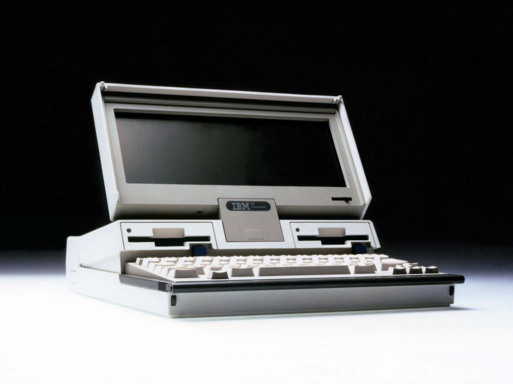
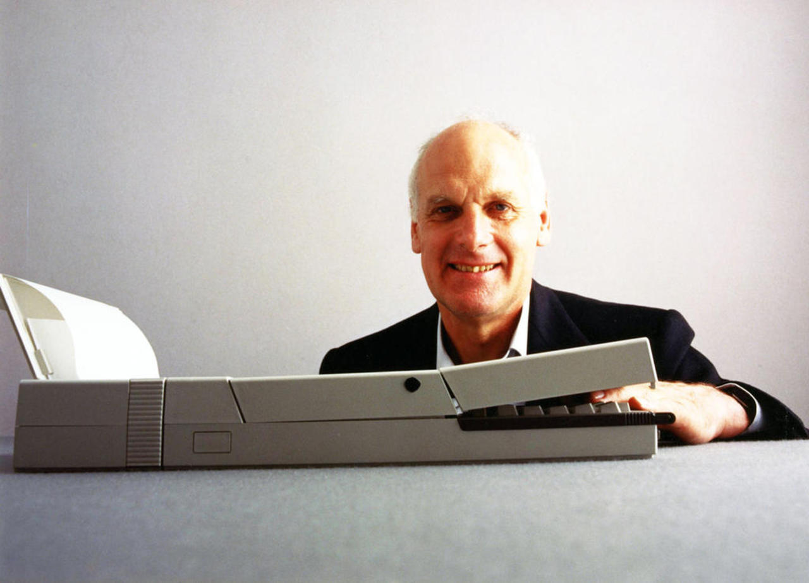
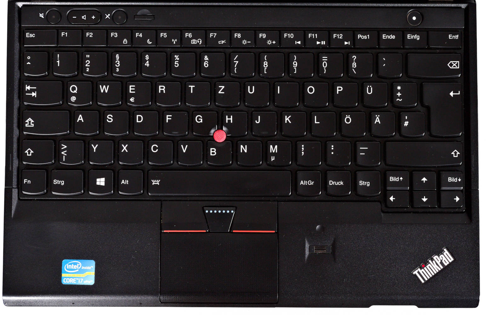
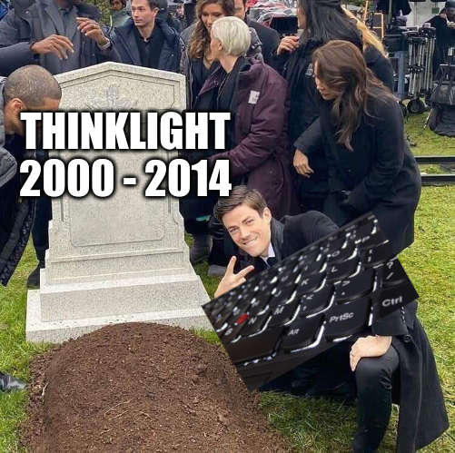
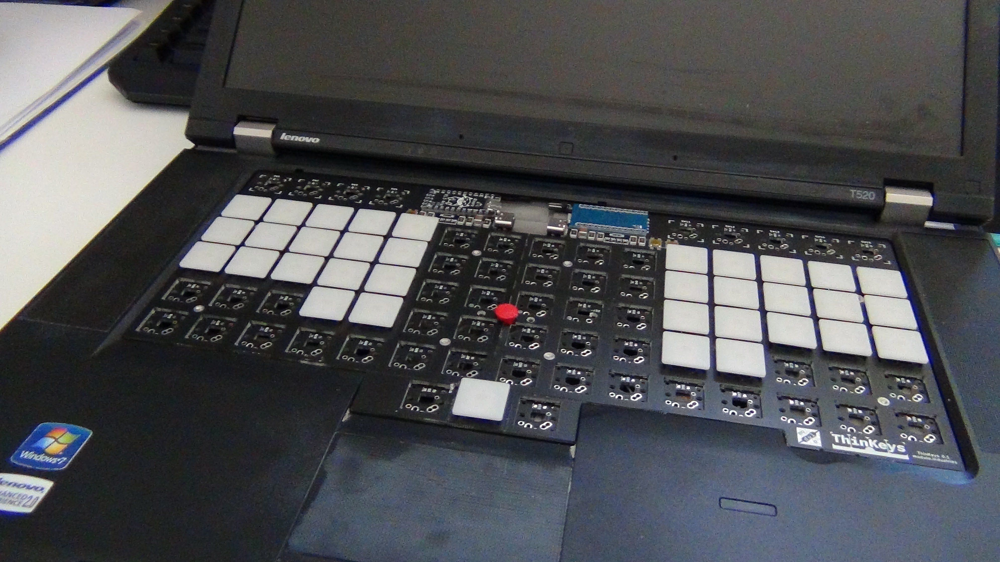
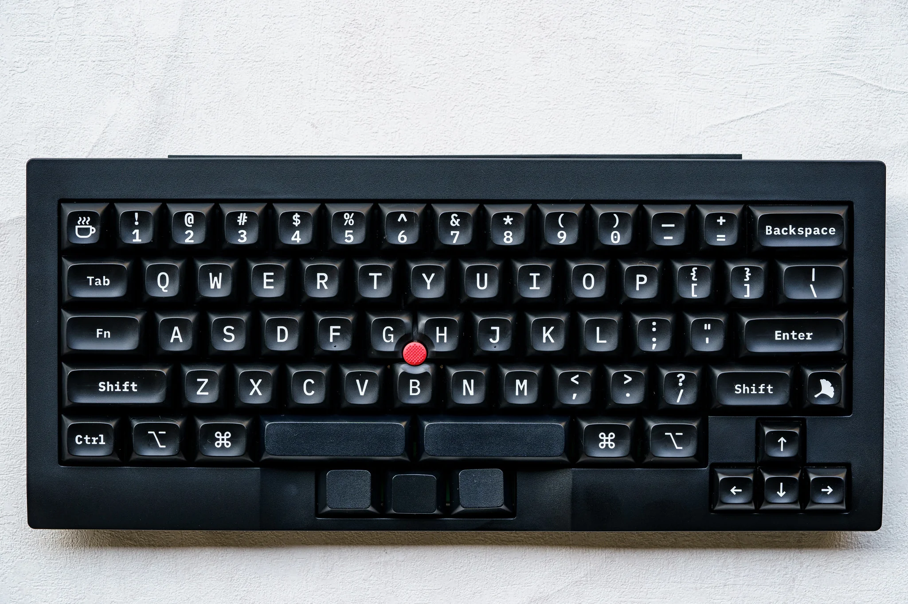

<!-- _class: lead -->

# 🔴 ThinkPads

#### Input devices

 

Christian ~~Clackowic~~ Stankowic
CCH|CON 2025
08.02.2025

---

<!-- _header: `whoami` -->

- Christian Stankowic
- [@stdevel@chaos.social](https://chaos.social/@stdevel) 🐘
- IT consultant and trainer 👨🏻‍🏫
- collects obsolete hardware
- Blogger ([cstan.io](https://cstan.io) 📖)
- Podcaster 🎙️
  - [FOCUS ON: Linux](https://focusonlinux.podigee.io) 🐧
  - [Faxinformatiker](https://faxinformatiker.de) 📠
  - [ThinkPad-Museum](https://thinkpad-museum.de/episode) 💻

---

<!-- _header: ThinkPad museum -->

- Online museum as **blog**
- lists collection details
  - **68** <u>different</u> notebooks
  - **3** PDAs
  - **12** Docking stations
- **WIP**: photo galleries and additional post series
- monthly **podcast** (🇩🇪)
- 🔴 [thinkpad-museum.com](https://thinkpad-museum.com)

---

<!-- _header: ThinkPad museum -->

Part of the collection

Transporting the collection

---

<!-- _header: Agenda -->

1. What happened so far... ⏪
1. Short TrackPoint history 🔴
1. Keyboards ⌨️
1. Hacks and outlook 🔨

---

<!-- _header: '`tar cvfz tldw.tgz https://media.ccc.de/v/froscon2024-3141-thinkpads`' -->

<!-- 
 -->

- ThinkPads are frequently encountered in business and hacker circles
- **1992** to **2005** produced by IBM, since then by Lenovo
- stand for **robust** and durable devices
- **timeless** design, practical
- different **series** with many models

POV: You've watched [part one (🇩🇪)](https://media.ccc.de/v/froscon2024-3141-thinkpads)

<!-- 
 -->

---

<!-- _header: Timeless design that is still recognizable today -->

IBM ThinkPad T23 (2001)

Lenovo ThinkPad T470p (2017)

<!--

- Clamshell design no longer available from Lenovo
- Blue color is omitted
- red accents on TrackPoint and TrackPad remain
- slanted logo is still a brand

-->

---

<!--
_header: Richard Sapper (1932 - 2015†)
footer: '[[1]](https://en.wikipedia.org/wiki/Richard_Sapper)'
-->

<!--
_header: Richard Sapper (1932 - 2015†)
footer: '[[1]](https://en.wikipedia.org/wiki/Richard_Sapper)'
-->

- one of the most important product designers of the second half of the 20th century
- known for numerous innovative designs, e.g.
  - Artemide Tizio table lamp
  - Alessi kitchen appliances
  - ...
- from 1979 **leading design consultant** at IBM
- shaped and standardized IBM designs
  - **black** color for ThinkPads
  - **red** TrackPoint

---

<!-- _header: Richard Sapper -->
<!-- footer: '[[2]](https://commons.wikimedia.org/wiki/File:Lampe_Tizio_von_Richard_Sapper.jpg), [[3]](https://richardsapperdesign.com/products/mod-5140/)' -->

Artemide Tizio

IBM PC Convertible Model 5140

<!--

- Lorenz Static (1960)
- IBM PC Convertible Model 5140 (1986)

-->

---

<!-- _header: IBM PC Convertible Model 5140 (1986) -->
<!-- footer: '[[3]](https://richardsapperdesign.com/products/mod-5140/)' -->

---

<!--
footer: '[[4]](https://www.reddit.com/r/thinkpad/comments/h16v1f/tizio_and_thinkpad_the_perfect_classical)' -->

<!--

- Artemide Tizio 50 + ThinkPad T430

-->

---

<!-- _header: Ready? -->
<!-- footer: '' -->

---

<!-- _header: Short TrackPoint history -->
<!-- footer: '[[5]](https://youtu.be/Wpw7Bml_XvI), Patent expired **2007**, other manufacturers also had alternatives before then' -->

- invented in the late **1980s** by **Dr. Ted Selker** as a mouse replacement*
- Rubber surface between the **G**, **H** and **B** buttons
- **precise** operation, reminiscent of **joystick**
  - Finger can remain on the keyboard
  - no “touchpad rowing"
  - requires training
- went into production with the ThinkPad 700
  - also inspired other manufacturers

---

<!-- _header: Short TrackPoint history -->
<!-- footer: '[[6]](https://de.wikipedia.org/wiki/Datei:Pointing_stick_of_a_Lenovo_ThinkPad_keyboard-4488.jpg), Patent expired **2007**, other manufacturers also had alternatives before then' -->

- Function is based on **measurement** of the force exerted via **stretch marks**
- these are **elastically** deformed, permanently applied **tension** thus changes
- integrated circuit converts these analog signals
- can now also be found in other keyboards

---

<!-- _header: Trivia: Different TrackPoint types -->
<!-- footer: '[[7]](https://www.reddit.com/r/thinkpad/comments/h16v1f/tizio_and_thinkpad_the_perfect_classical)' -->

<!--

- have been continuously optimised over the years
- became smaller as the devices also became smaller
- Cheap replicas can be recognised by the fact that they quickly become **spotty**

-->

---

<!-- _header: Break in style: first ThinkPad without TrackPoint 😰 -->
<!-- footer: '' -->

- The new **X9 Aura Edition** series was [presented at CES 2025](https://www.golem.de/news/thinkpad-x9-neues-design-aendert-tastatur-und-streicht-trackpoint-2501-192155.html)
  - deliberately designed for new customers
- available in 14" and 15"
- disruptive **redesign**, silver instead of black housing
- revised keyboard with CoPilot key and **without TrackPoint**
- slim form factor: between 6.7 and 17.2 mm case height
- controversial, strongly negative feedback from the community
- Jerry Paradise (Lenovo VP) [said 2022](https://www.notebookcheck.net/Lenovo-promises-TrackPoint-will-always-be-present-on-ThinkPads.676589.0.html):

> ‘We believe that the TrackPoint will always exist as long as the ThinkPad brand exists. That's our promise to our customers, and we believe it's still an iconic part of the ThinkPad design.’ 

---

<!-- _header: Break in style: first ThinkPad without TrackPoint 😰 -->
<!-- footer: '[[8]](https://www.lenovo.com/de/de/p/laptops/thinkpad/thinkpadx9/thinkpad-x9-aura-edition-15-inch-intel/len101t0111)' -->

---

<!-- _header: Keyboards -->
<!-- footer: '' -->

- were **USP** for ThinkPads for a long time
  - pleasant tactile feedback
  - indestructible quality
  - easy to change
- IBM built high-quality keyboards for a long time
- Numerous changes over the years
  - no longer anything special 🥲

---

<!-- _header: IBM and keyboards -->
<!-- footer: 'Hear also [CCH029 - Model F 🎙️](https://www.clickclackhack.de/029.html) and [CCH015 - Model M 🎙️](https://www.clickclackhack.de/015.html)' -->

- IBM produced long keyboards after typewriters
  - [Model B](https://sharktastica.co.uk/wiki?id=modelb) - **Beamspring** (1972 - 1983)
  - [Model F](https://sharktastica.co.uk/wiki?id=modelf) - capacitive **Buckling Springs** (1981 - 1986)
  - [Model M](https://sharktastica.co.uk/wiki?id=modelm) - membrane Buckling Springs (1984 - 1996)
- Not all keyboards were legendary: **IBM PCjr Keyboard**
- In 1991, Lexmark was formed through the sale of IBM's printer/keyboard division
- 1996 IBM stopped selling Buckling Spring keyboards
- Ex-IBM/Lexmark employees founded [Unicomp](https://www.pckeyboard.com)
- Model F and B have also been [produced again](https://www.modelfkeyboards.com/) since 2016

---

<!--
_header: 'IBM PCjr Keyboard (1984)'
footer: '[[9]](https://regmedia.co.uk/2014/03/20/keyboard_chiclet_large.jpg)' -->

---

<!--
_header: '5251/5252 Display Station Typewriter Keyboard (1977)'
footer: '[[10]](https://sharktastica.co.uk/wiki?id=modelb)' -->

---

<!--
_header: 'IBM 3290 Information Panel Data Typewriter Keyboard (1983)'
footer: '[[11]](https://sharktastica.co.uk/wiki?id=modelf)' -->

---

<!--
_header: 'IBM Enhanced Keyboard (1985)'
footer: '[[12]](https://sharktastica.co.uk/wiki?id=modelm)' -->

---

<!-- _header: ThinkPad keyboards -->
<!-- footer: '[[13]](https://deskthority.net/wiki/Scissor_switch)' -->

- all generations have **scissor switches**
  - formerly NMB, Chicony, ALPS, now only Chicony and LiteOn
- Opposite stabilizers, connected via a hinge
- enables scissor mechanism with low height
- the **key travel** decreased over the years
  - 3mm (199x), 2.5mm (2000-2012), 2.1mm (2013-2017), **1.8mm** (2016-2021), 1.5mm (2021-2024), 1.35mm (since 2021)

---

<!-- _header: TrackWrite keyboard (1995 - 1996) -->
<!-- footer: 'Patent and trademark office like: Lol, nope 🙅🏻‍♂️' -->

- Keyboard of the **701**, which was originally to be called **Butterfly**
- approx. **24.7 cm** wide keyboard, extends to **29.3 cm**
  - about as wide as the keyboard of a T60, remarkably comfortable
  - Keyboard folds out **diagonally**
- Production of the device **delayed** several times
  - partly due to the keyboard
  - when it was released in 1995, the 80486 was hopelessly outdated
- device won numerous awards
  - but wasn't a commercial success
- most iconic ThinkPad of all time

---

<!-- _header: TrackWrite keyboard (1995 - 1996) -->
<!-- footer: '[[14]](https://en.wikipedia.org/wiki/File:IBM_ThinkPad_701C_keyboard.jpg), [[15]](https://youtu.be/rDjg4dKWQ2Y)' -->

---

<!-- _header: OG keyboard (here: 760EL, 1996) -->
<!-- footer: '' -->

- 7-row design, only 6 rows on small devices (e.g. 240)
- no special keys or LEDs, from the 700 (1992) to the 600X (2000)

<!--

- Blue and green markers for multiple assignments

-->

---

<!-- _header: 'Classic keyboard (here: T23, 2002)' -->

- introduced with the A/T/X20, had also **middle mouse button**
- **special buttons** (volume, setup), status **LEDs** and on/off button

---

<!-- _header: 'Classic keyboard (here: T30, 2003)' -->

- Slightly different design from the T/R/X30 onwards
  - blue and grey colors, smaller mouse buttons (**UltraNav** preparation)

---

<!-- _header: 'Classic keyboard (here: R40, 2003)' -->

- No more status LEDs from the T/R/X/G40 , **Access IBM** button

<!--

- BIOS call via Access IBM key
- Pre-boot environment with restore function
  - Requires service partition on the hard disk

-->

---

<!-- _header: 'Classic keyboard (here: T60p, 2007)' -->

- No more gray contrast as of T/R/X60
- TrackPoint buttons no longer have colors

---

<!-- _header: 'Classic keyboard (here: T410, 2010)' -->

- from the T410/X220 **illuminated** function keys, **rocker switch** for volume and **double height** of the ESC/ENTF key

---

<!-- _header: Precision keyboard -->
<!-- footer: '[[16]](https://nuts.com/images/auto/801x534/assets/869ed4decfec61cb.jpg)' -->

- **2012** introduced in **T**, **W**, **X** and **L** series
  - installed in the **X1** for the first time
  - further tests in the Edge and X1xxe series
- **Chiclet** or Island Style keyboard
  - flat square keys with rounded corners
  - remembers of american chiclet **chewing gum**
- **6** instead of 7 rows, even on large devices
  - more **space** between the keys
  - **larger** keys, to prevent typing errors
  - no more separate function keys

---

<!-- _header: Precision keyboard (X230, 2012) -->
<!-- footer: '' -->

---

<!-- _header: Precision keyboard -->

- Page forward/next moves image down/up
- no more Num and context menu buttons
- no more blue color elements
- Buttons now only **2mm** instead of 2.5mm **high**
- **mechanism** unchanged
- **Backlight**, thus elimination of the **ThinkLight**
- Keyboard coating varies depending on the variant
  - without backlight: matt, non-slip, opaque
  - with backlight: smooth, slightly slippery finish

---

<!-- _header: Classic keyboard revival (T25, 2017) -->

---

<!-- _header: Hacks -->

- [WorkBook](https://hackaday.io/project/191579-workbook-framework-13-classic-kb-trackpoint) 👻
  - Mockup for **Framework 13** with Classic Keyboard and TrackPoint
- [ThinKeys](https://github.com/moduloindustries/thinkeys) project
  - **Ortholinear** keyboard for T410-30, T510-30, W510-30 and X220/230
  - **QMK**, with TrackPoint, can also be used externally via USB-C

- Exciting **switches** for very flat keyboards
  - [Cherry MX ULP Tactile](https://www.cherry.de/mx-ulp-tactile) (65 cN, 1.8mm Travel, LED Underglow, 50 Mio.)
  - [Kailh PG1316S](https://keycapsss.com/switchestester/switches/282/kailh-pg1316s-ultra-thin-notebook-switch) (32-60 cN, 1.8mm travel, LED underglow, 20 million)
- [mnhTTn](https://github.com/fooker/mnhttn) (**first** DIY split with Cherry MX ULP switches, 36 keys)

---

<!-- _header: WorkBook and ThinKeys -->
<!-- footer: '[[17]](https://hackaday.io/project/191579-workbook-framework-13-classic-kb-trackpoint), [[18]](https://github.com/moduloindustries/thinkeys)' -->

WorkBook (2024)

ThinKeys (2022)

---

<!-- _header: Cherry MX ULP Tactile and mnhTTn -->
<!-- footer: '[[19]](https://www.cherry.de/de-de/produkt/mx-ulp-tactile), [[20]](https://github.com/fooker/mnhttn)' -->

Cherry MX ULP Tactile (2024)

mnhTTn (2024)

---

<!-- _header: Influence on mechanical keyboards -->
<!-- footer: '' -->

- There are also mechanical keyboards in *ThinkPad style*, e.g:
  - [Tex Shinobi](https://tex.com.tw/products/shinobi)
    - Replica of IBM/Lenovo [SK-8845](https://sharktastica.co.uk/topics/trackpoint_kbs#SK-8845)/[8855](https://sharktastica.co.uk/topics/trackpoint_kbs#SK-8855)
    - ABS, Cherry MX1A, USB-C, 1.2 kg
    - optionally as [DIY edition](https://tex.com.tw/products/shinobi-diy-type) with hotswap
  - [Tex Shura](https://tex.com.tw/products/shura) (60%, TrackPoint and UltraNav)
    - ABS (US) or laser (EU/JIS), Cherry MX1A, USB-C, 1.0 kg
    - optionally as [DIY edition](https://tex.com.tw/products/shura-diy-type) with hotswap (but without ISO-DE 🤡🤡🤡)
- Keycaps
  - [GMK ThinkCaps](https://drop.com/talk/39383/gmk-think-caps), black keys, grey and blue accents
    - optionally also classic IBM colours

<!--

- also available as Hotswap and ISO-DE

-->

---

<!-- _header: Lenovo SK-8855 and Tex Shinobi -->
<!-- footer: '[[21]](https://sharktastica.co.uk/topics/trackpoint_kbs#SK-8855), [[22]](https://tex.com.tw/products/shinobi)' -->

Lenovo SK-8855 (2009)

Tex Shinobi (2020)

---

<!-- _header: Tex Shura (2022) -->
<!-- footer: '[[23]](https://tex.com.tw/products/shura)' -->

Optional aluminium case

---

<!-- _header: Links -->
<!-- footer: '' -->

- [FrOSCon 2024: ThinkPads - Geschichte und Nerdkultur](https://github.com/stdevel/froscon2024-thinkpads/) [🎥🇩🇪](https://media.ccc.de/v/froscon2024-3141-thinkpads)
- [MRMCD 2024: Eingabegeräte und Kuriositäten](https://github.com/stdevel/mrmcd2024-thinkpads/) [🎥🇩🇪](https://media.ccc.de/v/2024-339-thinkpads-geschichte-und-trivia)
- [ThinkPad-Forum](https://thinkpad-forum.de) und [ThinkPad-Wiki](https://thinkwiki.de)
- [Internationales ThinkWiki](https://thinkwiki.org)
- [Notebookcheck-Beiträge zu ThinkPads](https://www.notebookcheck.com/News.37.0.html?ns_layout=3&hide_youtube=1&ns_show_num_normal=50&hide_external_reviews=1&tagArray%5B%5D=153&typeArray%5B%5D=4&typeArray%5B%5D=6&id=37)
- [Laptop Retrospective](https://laptopretrospective.com) 🎥📖
- [HK003 - ThinkPads](https://hacker-kultur.de/episodes/003.html) 🎙️🇩🇪
- [ThinkPad-Museum](https://thinkpad-museum.de)
- [ThinkPad-Museum Datenbank](https://db.thinkpad-museum.de)

---

<!-- _header: ThinkPad museum podcast -->

- published every **monthly**
- deals with the past and present
- News, models, techniques and personalities
- **interactive** format, guests welcome!
- available wherever you get your podcasts™
  - [Feed](https://podcasts.darmstadt.social/@thinkpadmuseum/feed.xml), [fyyd](https://fyyd.de/podcast/thinkpad-museum-podcast), [Apple Podcasts](https://podcasts.apple.com/us/podcast/thinkpad-museum-podcast/id1722845536), [Spotify](https://open.spotify.com/show/1Tyf65RpY3bKZr0xYVFhjc)

---

<!-- _header: Image sources -->

- [Richard Sapper](https://en.wikipedia.org/wiki/Richard_Sapper)
- [Artemide Tizio](https://commons.wikimedia.org/wiki/File:Lampe_Tizio_von_Richard_Sapper.jpg)
- [IBM Model 5140](https://richardsapperdesign.com/products/mod-5140/)
- [Tizio und T430](https://www.reddit.com/r/thinkpad/comments/h16v1f/tizio_and_thinkpad_the_perfect_classical)
- [Ted Selker](https://youtu.be/Wpw7Bml_XvI)
- [TrackPoint PCB](https://de.wikipedia.org/wiki/Datei:Pointing_stick_of_a_Lenovo_ThinkPad_keyboard-4488.jpg)
- [TrackPoint-Typen](https://www.reddit.com/r/thinkpad/comments/h16v1f/tizio_and_thinkpad_the_perfect_classical)
- [ThinkPad X9 Aura Edition](https://www.lenovo.com/de/de/p/laptops/thinkpad/thinkpadx9/thinkpad-x9-aura-edition-15-inch-intel/len101t0111)
- [IBM PCjr Keyboard](https://regmedia.co.uk/2014/03/20/keyboard_chiclet_large.jpg)
- [5251/5252 Display Station Typewriter Keyboard](https://sharktastica.co.uk/wiki?id=modelb)
- [IBM 3290 Information Panel Data Typewriter Keyboard](https://sharktastica.co.uk/wiki?id=modelf)
- [IBM Enhanced Keyboard](https://sharktastica.co.uk/wiki?id=modelm)
- [Scissor Switch](https://deskthority.net/wiki/Scissor_switch)
- [TrackWrite Keyboard](https://en.wikipedia.org/wiki/File:IBM_ThinkPad_701C_keyboard.jpg)

- [George Karidis](https://youtu.be/rDjg4dKWQ2Y)
- [Chiclet Gum](https://nuts.com/images/auto/801x534/assets/869ed4decfec61cb.jpg)
- [WorkBook](https://hackaday.io/project/191579-workbook-framework-13-classic-kb-trackpoint)
- [ThinKeys](https://github.com/moduloindustries/thinkeys)
- [Cherry MX ULP Tactile](https://www.cherry.de/de-de/produkt/mx-ulp-tactile)
- [mnhTTn](https://github.com/fooker/mnhttn)
- [Lenovo SK-8855](https://sharktastica.co.uk/topics/trackpoint_kbs#SK-8855)
- [Tex Shinobi](https://tex.com.tw/products/shinobi)
- [Tex Shura](https://tex.com.tw/products/shura)

---

<!-- _class: lead -->

# 🔴 Thank you for your attention
